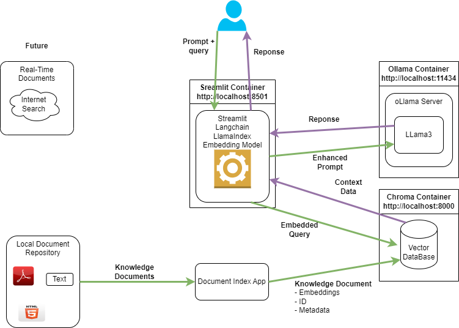

## Table of Contents

 - [README](../README.md)
 - [Project Proposal](project_proposal.md)
 - [Technical Approach](technical_approach.md)
 - [Application Packages](application_packages.md) Used in this project
   - [Knowledge Documents](knowledge_documents.md)
   - [User Interface](user_interface.md)
   - [LLMs](LLMs.md)
   - [Embeddings](embedding.md)
   - [Vector Database](vectorDB.md)
   - [Other Notes](misc_notes.md)
 - [References](references.md)

# Technical Approach

# Applications and Packages for Knowledge Based LLM

The application packages used in this project are described here.  More information on the details and options for the application components can be found in the following documents.

## Langchain or Llamaindex

- [Langchain](https://www.langchain.com/)
  - [Documentation](https://python.langchain.com/v0.2/docs/introduction/)
  - [Templates](https://templates.langchain.com/)
  - [Integrations](https://python.langchain.com/v0.2/docs/integrations/platforms/)

## Llamaindex

- [LlamaIndex](https://www.llamaindex.ai/open-source)
  - [Getting Started](https://docs.llamaindex.ai/en/stable/getting_started/concepts/)

## Embedding Model

Embeddings encode complex, high-dimensional data into lower dimensional numeric space.  Using embeddings, prompts and response context can be matched by finding the closest embedded content in the embedding space.

The embedding model selected for this project is: **TBD**

This embedding model was selected for ......

## Vector Database

A Vector Database is designed to store and retrieve embeddings.  The vector database makes it possible to query with the embedded user prompt and return the documents that most closely match the embedding.

See VectorDB integrations in Langchain and Llamaindex

The vector database used in this project is: **TBD**
- ChromaDB??

This vector database was selected for ......

## LLM Model

The LLM model is used to provide a response based on the query and knowledge base context.  This solution uses 

## User Interface

**Note:**  This may come with Llamaindex.

----
----
----
----
----

# Steps:

- Document Prep
  - Local Doc Store
  - Review local doc store and split documents
  - create embeddings
  - save in VectorDB

- 
Chroma Vector DB
Ollama

