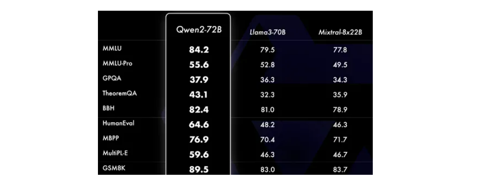
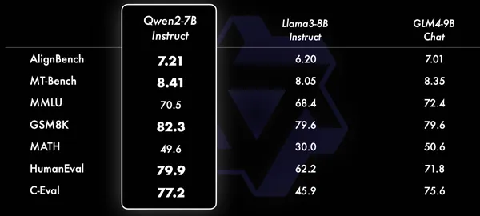

# LLM Models

## Leaderboards

- LLMs - https://huggingface.co/spaces/open-llm-leaderboard/open_llm_leaderboard
- Chatbot - https://huggingface.co/spaces/lmsys/chatbot-arena-leaderboard
- Embeddings - https://huggingface.co/spaces/mteb/leaderboard
- Code (CoPilot) https://huggingface.co/spaces/bigcode/bigcode-models-leaderboard

## General Notes:

Configure all the server and model settings in a `server.config` file.  

**See** [Llama-cpp](../prototype/jeff/2-llm-server/llama-cpp/README.md) Section 6: Server Configuration using a `server.config` file

- [Server Settings](https://llama-cpp-python.readthedocs.io/en/latest/server/#llama_cpp.server.settings.ServerSettings)
  - [OpenAI Compatible Server](https://llama-cpp-python.readthedocs.io/en/latest/server/)
  - [Server Options Reference](https://llama-cpp-python.readthedocs.io/en/latest/server/#server-options-reference)
- [Model Settings](https://llama-cpp-python.readthedocs.io/en/latest/server/#llama_cpp.server.settings.ModelSettings)
  - [Configuration and Multi-Model Support](https://llama-cpp-python.readthedocs.io/en/latest/server/#configuration-and-multi-model-support) - has a sample `server.config` and show how to configure/load multiple models.
  - [Using Safetensors](https://gist.github.com/AltAcc1812/0bc4b80838b49b6c3bdce9d94b66cb54)

## Qwen (Large and Small Models)

- **large model** - [qwen2_7b](qwen2_7b/README.md)
- **small model** - [qwen2_500m](qwen2_500m/README.md)
- https://github.com/QwenLM/Qwen2
- https://huggingface.co/Qwen
- https://www.analyticsvidhya.com/blog/2024/06/qwen2/
- Download:  https://huggingface.co/Qwen/Qwen2-7B-Instruct-GGUF/tree/main

## Llama3

- [llama3_8b](llama3_8b/README.md)
- https://huggingface.co/meta-llama/Meta-Llama-3-8B
- https://github.com/meta-llama/llama3
- Download https://huggingface.co/QuantFactory/Meta-Llama-3-8B-Instruct-GGUF (5.5GB)
- 

## Mistral

- [mistral_7b](mistral_7b/README.md)
- https://github.com/mistralai/mistral-common
- https://huggingface.co/mistralai
- Download: https://huggingface.co/TheBloke/Mistral-7B-Instruct-v0.2-GGUF (5.5GB)
- Embeddings: https://docs.mistral.ai/capabilities/embeddings/
- 

## internlm/internlm2_5-7b-chat

- [internlm2_7b](internlm2_7b/README.md)
- https://huggingface.co/internlm
- https://github.com/InternLM/InternLM
- Download https://huggingface.co/bartowski/internlm2_5-7b-chat-1m-GGUF/tree/main (5.5GB)

# Embedding Models

## Stella (Large)

- [em_stella_en](em_stella_en/README.md)
- https://huggingface.co/dunzhang/stella_en_400M_v5

## GTE Base (Small)

- [em_gte_base_en](em_gte_base_en/README.md)

